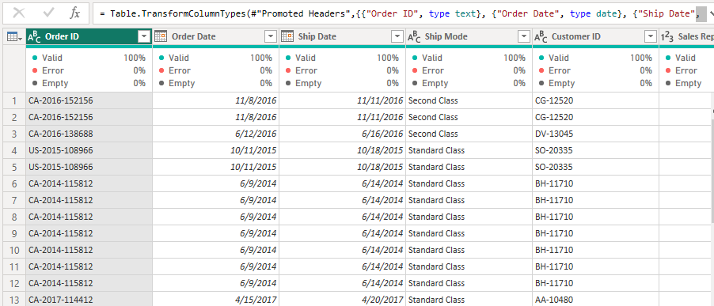
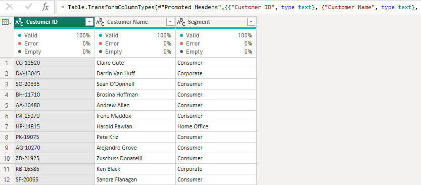
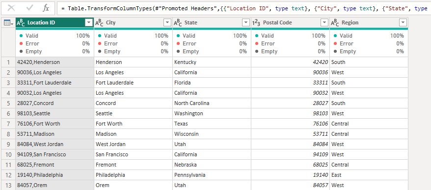

# Sales Intelligence with Power BI

### Introduction
This project is to display my data modeling skills, DAX knowledge, and Visualization skills acquired in the data analytics track with Quantum Analytics NG of learning using POWER BI.
The problem statement is an imaginary case scenario I thought about after seeing the dataset.

### Problem Statements
The stakeholders of an international company in the United States wish to award the customer with the highest sales and the best sales rep, 
the sales change relative to last year, and also want to know the key criteria that are the drivers of performance. 
The stakeholders have hereby consulted me with carrying out a quick analysis and report. 

After the critical thinking, six questions need answers:

- The correlation strength between discount and sales?
- The correlation strength between transactions and sales?
- The sales change, relative to last year (Sales Year over Year)?
- Which Region/location has the highest sales made?
- Which Sales rep has made the highest sales?
- Which of our Customers purchased the highest sales?

### Data Sourcing
Data was normalized( i.e information was categorically separated into different tables) and resulted in 5 tables:

- Sales table
- Customers table
- Sales Reps table
- Location table
- Products table

Data was then, locally extracted from Excel Workbook into Power BI for transformation, analysis and visualization.

### Data Transformation
 The table appeared to be clean. The quality of each column is 100% with no error or nulls. Below is a preview of the tables:

|      |       |
| :--------: | :---------: |
| Sales Table | Customers Table |
      |  |
      |  |

