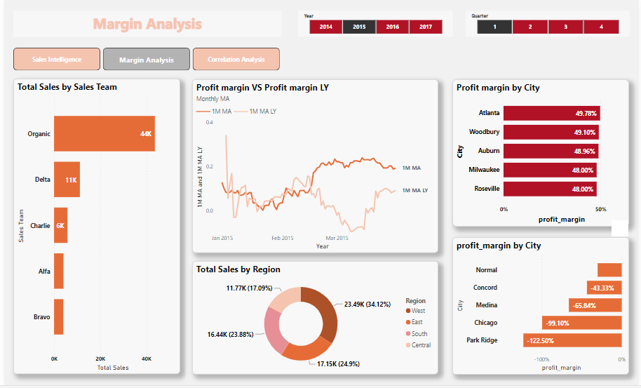

# Data Modeling with Power BI

### Introduction
This project is to display my data modeling skills, DAX knowledge, and Visualization skills acquired in the data analytics track with Quantum Analytics NG of learning using POWER BI.
The problem statement is an imaginary case scenario I thought about after seeing the dataset.

### Problem Statements
The stakeholders of an international company have hereby consulted me with carrying out a quick analysis and report on the following:
- Customer with the highest sales 
- sales change relative to last year
- Key drivers of sales performance
- other relevant insights

After the critical thinking, six questions need answers:

- The correlation strength between discount and sales?
- The correlation strength between transactions and sales?
- The sales change, relative to last year (Sales Year over Year)?
- Which Region has the highest sales made?
- Which Sales team has made the highest sales?

### Data Sourcing
Data was normalized( i.e information was categorically separated into different tables) and resulted in 5 tables:

- Sales table
- Customers table
- Sales Reps table
- Location table
- Products table

Data was then, locally extracted from Excel Workbook into Power BI for transformation, analysis and visualization.

### Data Transformation
 The table appeared to be clean. The quality of each column is 100% with no error or nulls. Below is a preview of the tables:

|      |       |
| :--------: | :---------: |
| Sales Table | Customers Table |
      |  |
| Sales Representative Table | Location Table |
      |  |
| Product Table |  |

### Data Model Design
There are five data required for this analysis. Therefore, appropriate modeling is required. A star Schema is designed with the Sales Table representing the fact table containing all redundant data, and to which other dimension tables are modeled or mapped with, using the column that is common. The sales Table has been modeled with:

- Customers Tables via "Customer ID"
- SalesRep Table using the "SalesRep ID"
- Locations Table using the "Location ID"
- Products Table using "Product ID"

  

### Visualization
Analysis was done using simple visuals since the tables have been perfectly modelled together.
The report contains three(3) pages, which include the following

#### 1. Sales Intelligence
- Cumulative sales current year VS Cumulative sales last year which can also be filtered down to quarters of the year relative to last year quarter
- Total sales, Total profits, and Total transactions

#### 2. Margin Analysis
- Total Sales by Product
- Monthly moving averages of the current year's profits relative to the last year's profits
- Profit margin by city
- Total sales by region

#### Correlation Analysis
- Transaction and sales correlation for customer
- Discount and sales correlation for customer

##### Sales Intelligence

##### Margin Sales

##### Correlation Analysis

### Conclusions/Recommendations
- The West region of the country generated the highest sales and profits.
- The organic team happened to be the team that generated the highest sales for the company and the team needs to be compensated.
- The discount does not really has an impact on the sales but the transactions do, therefore the stakeholders have to collaborate with the media department in order to create more awareness for products with low sales.

  

